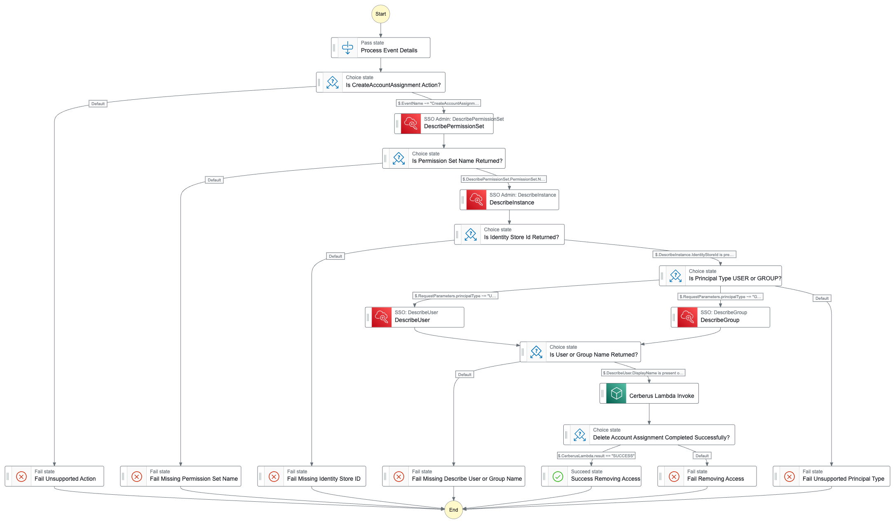

# Cerberus

Cerberus is a [AWS Serverless Application Model](https://docs.aws.amazon.com/serverless-application-model/latest/developerguide/serverless-getting-started.html) serverless application for managing AWS resources with the SAM CLI.

AWS SAM Amazon States Language (ASL) diagram of the Cerberus state machine.



## CloudFormation Template Parameters

The following parameters are defined in the `template.yaml` file and can be customized during deployment:

### EventBusName

- **Type**: String
- **Default**: `cerberus-event-bus`
- **Description**: The name of the custom EventBridge event bus for Cerberus.

### ManagementAccountId

- **Type**: String
- **Description**: The Management AWS account ID that will send events to the Cerberus event bus.
- **Allowed Pattern**: `^[0-9]{12}$`
- **Constraint Description**: Must be a valid 12-digit AWS account ID.

### LogGroupName

- **Type**: String
- **Default**: `/cerberus`
- **Description**: The name of the CloudWatch Log Group for the Cerberus State Machine.
- **Allowed Pattern**: `^[.\\-_/#A-Za-z0-9]{1,512}\\Z`
- **Min Length**: 1
- **Max Length**: 512
- **Constraint Description**: Log group name must be 1-512 characters long and can include letters, numbers, and the following characters: `.-_/#`.

### LogGroupRetentionDays

- **Type**: Number
- **Default**: 14
- **Description**: The retention period in days for the CloudWatch Log Group.
- **Allowed Values**: 1, 3, 5, 7, 14, 30, 60, 90, 120, 150, 180, 365, 400, 545, 731, 1096, 1827, 2192, 2557, 2922, 3288, 3653.

### PermissionSetNamePattern

- **Type**: String
- **Default**: `^AWS(?:OrganizationsFullAccess|ReadOnlyAccess|ServiceCatalogEndUserAccess|ServiceCatalogAdminFullAccess|PowerUserAccess|AdministratorAccess)$`
- **Description**: Regex pattern for matching AWS Control Tower default permission set names, such as `OrganizationsFullAccess` and `AdministratorAccess`.

### PrincipalGroupNamePattern

- **Type**: String
- **Default**: `^AWS(?:LogArchiveViewers|LogArchiveAdmins|ControlTowerAdmins|AccountFactory|AuditAccountAdmins|SecurityAuditors|ServiceCatalogAdmins|SecurityAuditPowerUsers)$`
- **Description**: Regex pattern for matching AWS Control Tower default group principal names, such as `LogArchiveAdmins` and `ControlTowerAdmins`.

### PrincipalUserNameEmail

- **Type**: String
- **Default**: (empty)
- **Description**: Valid email addresses used by AWS Control Tower account factory enrollment. Leave empty to disable validation.
- **Allowed Pattern**: `^$|^[a-zA-Z0-9._%+-]+@[a-zA-Z0-9.-]+\\.[a-zA-Z]{2,}$`
- **Constraint Description**: Must be a valid email address or left empty.

## Build and Deploy

### Build

Use the following command to build the application:

```bash
sam build --use-container
```

### Deploy

⚠️ IMPORTANT PARAMETERS ⚠️

#### `ManagementAccountId` and `EventBusName`

[AWS IAM Identity Center Documentation, Delegated administration](https://docs.aws.amazon.com/singlesignon/latest/userguide/delegated-admin.html). IAM Identity Center instance must always reside in the management account, they can be configured to delegate administration of IAM Identity Center to a member account in AWS Organizations, thereby extending the ability to manage IAM Identity Center from outside the management account.

This parmeter enables support for environments following the best-practice of delegating the access via another AWS account. These parameters enable the integration with the [cft-eventbridge-rule.yaml](../cft-eventbridge-rule.yaml) template to deploy the Event Bridge Rule in the Management account.

#### `PrincipalUserNameEmail`

[AWS Control Tower Documentation, Provision accounts with AWS Service Catalog Account Factory](https://docs.aws.amazon.com/controltower/latest/userguide/provision-as-end-user.html). When creating or updating an Account Factory enrolled account, the `SSOUserEmail` prompt can be a new email address, or the email address associated with an existing IAM Identity Center user. Whichever choen, this user will have administrative access to the account you're provisioning.

This parameter enables removal of the default User assignment that will have administrative access. The pattern requires that a common email address be used when performing changes to accounts via AWS Control Tower Account Factory. Example `aws-control-tower@company.xyz`.

Deploy the application with the following command:

```bash
sam deploy --region us-east-1 --parameter-overrides ManagementAccountId=012345678901 LogGroupName=/cerberus
```

To include RegEx patterns for permissions and principals, use:

```bash
sam deploy --region us-east-1 --parameter-overrides ManagementAccountId=012345678901 LogGroupName=/cerberus PermissionSetNamePattern='^AWS(?:OrganizationsFullAccess|ReadOnlyAccess|ServiceCatalogEndUserAccess|ServiceCatalogAdminFullAccess|PowerUserAccess|AdministratorAccess)$' PrincipalNamePattern='^AWS(?:LogArchiveViewers|LogArchiveAdmins|ControlTowerAdmins|AccountFactory|AuditAccountAdmins|SecurityAuditors|ServiceCatalogAdmins|SecurityAuditPowerUsers)$' PrincipalUserNameEmail='devops+control-tower-account-factory@company.xyz'
```

## Testing

### Unit Tests

Run unit tests using the following commands:

```bash
python3 -m venv venv
source venv/bin/activate
pip install -r tests/requirements.txt
python3 -m unittest discover -v
```

## Cleanup

To delete the deployed stack, use:

```bash
sam delete --stack-name "cerberus"
```
